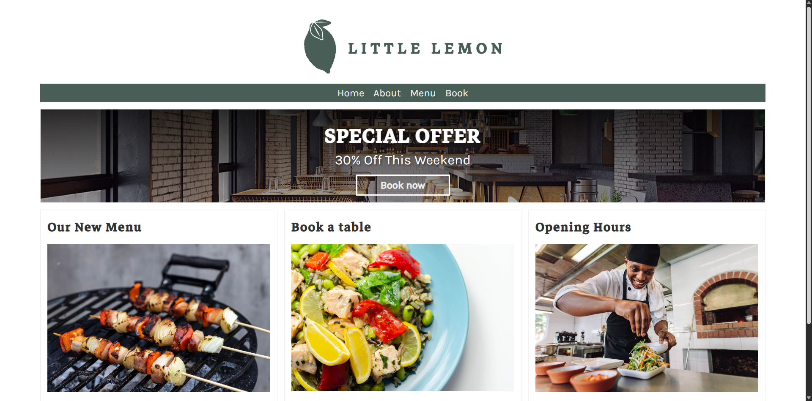

# Little Lemon Django Web App 🍋

This repository contains the source code for **Little Lemon**, a Django-based restaurant web application. It demonstrates full-stack web development using Django's **Model-View-Template (MVT)** architecture, SQLite database, and static/media file integration. It includes features for menu display, bookings, and dynamic page rendering.

---

## 📁 Project Structure

```
v41bh4vr4jput-littlelemon/
├── README.md                     # Project documentation
├── db.sqlite3                    # SQLite database file
├── manage.py                     # Django management script
├── Menu items.docx               # Menu item reference document
├── Pipfile                       # Project dependencies
├── littlelemon/                  # Project settings and config
│   ├── __init__.py
│   ├── asgi.py
│   ├── settings.py
│   ├── urls.py                   # Root URL configuration
│   ├── wsgi.py
│   └── __pycache__/
└── restaurant/                   # Core application logic
    ├── __init__.py
    ├── admin.py                  # Admin panel registration
    ├── apps.py
    ├── forms.py                  # Django form definitions
    ├── models.py                 # Database models (e.g., Menu, Booking)
    ├── tests.py                  # Unit tests
    ├── urls.py                   # App-level URL routes
    ├── views.py                  # View logic for rendering pages
    ├── __pycache__/
    ├── migrations/               # Database schema migrations
    │   ├── 0001_initial.py
    │   ├── 0002_menu_description.py
    │   └── __init__.py
    ├── static/                   # Static files (CSS & images)
    │   ├── css/
    │   │   └── style.css
    │   └── img/
    │       └── menu_items/
    └── templates/               # HTML templates for pages
        ├── about.html
        ├── base.html
        ├── book.html
        ├── index.html
        ├── menu.html
        ├── Menu_item.html
        └── partials/            # Template partials for reuse
            ├── _footer.html
            └── _header.html
```

---

## ✨ Features

* 🍽️ Dynamic **Menu** display from database
* 📆 **Table Booking** form using Django Forms
* 🖼️ Templating with reusable components (`base.html`, `_header.html`, `_footer.html`)
* 🎨 Styling with custom CSS and image integration
* 🔧 Admin dashboard for managing models

---

## 🖼️ Screenshots

### 🏠 Homepage



### 📋 Menu Page


### 📅 Booking Form


---

## ⚙️ Setup Instructions

1. **Clone the repository**:

```bash
git clone https://github.com/your-username/v41bh4vr4jput-littlelemon.git
cd v41bh4vr4jput-littlelemon
```

2. **Install dependencies**:

```bash
pip install pipenv
pipenv install
pipenv shell
```

3. **Run migrations**:

```bash
python manage.py makemigrations
python manage.py migrate
```

4. **Create superuser** (optional for admin access):

```bash
python manage.py createsuperuser
```

5. **Run the development server**:

```bash
python manage.py runserver
```

Open in your browser:

```
http://127.0.0.1:8000/
```

---

## 📌 Notes

* The **Menu items.docx** file contains a list of menu items used for testing.
* Static and media files are stored under the `static/` directory and served during development.
* Templates are organized with a layout (`base.html`) and partials for modular HTML structure.

---

